# Overview

This benchmark evaluates IQ-TREE's phylogenetic likelihood computation on complex substitution models using two backends: a single-core CPU (VANILA) and an NVIDIA Tesla V100 GPU (via OpenACC). The goal is to quantify GPU speedup over CPU on a wider, more computationally demanding set of models than the previous benchmark.

# Dataset

Simulated alignments with 100 taxa and 1,000,000 sites were used. Ten distinct tree topologies (tree_1 through tree_10) were generated per model, and each configuration was run 10 times to capture runtime variance. Both rooted and unrooted topologies were tested.

Two sequence types were tested:

- **DNA**: models GTR+R, GTR+I+G, TN, TVM
- **Amino acid (AA)**: models Dayhoff, mtREV, cpREV, LG4M, C60, LG+C60

# Backends

- **IQ-TREE CPU 1-core** (VANILA): single-threaded CPU baseline
- **IQ-TREE GPU V100** (OPENACC): NVIDIA Tesla V100 GPU via OpenACC

**Note:** Only two backends were benchmarked in this run (no 10-core or 48-core CPU). Speedup is therefore reported as GPU vs. CPU 1-core only.

# Data Availability and Failures

Not all model-backend combinations completed successfully:

| Model | VANILA (CPU) | OPENACC (GPU) | Reason |
|-------|-------------|---------------|--------|
| AA Dayhoff | 200/200 | 200/200 | - |
| AA mtREV | 200/200 | 200/200 | - |
| AA cpREV | 200/200 | 200/200 | - |
| AA LG4M | 0/20 | 0/20 | Truncated - run exceeded available memory per core (54 GB required) |
| AA C60 | 0/20 (RAM error) | 0/20 | RAM error - 310 GB required |
| AA LG+C60 | 0/20 (RAM error) | 0/20 | RAM error - 310 GB required |
| DNA TN | 200/200 | 200/200 | - |
| DNA TVM | 200/200 | 200/200 | - |
| DNA GTR+R | 0/200 | 181/200 | VANILA: `-blfix` flag incompatible with rate-heterogeneity models; OPENACC: tree_10 truncated (numerical underflow) |
| DNA GTR+I+G | 0/120 | 100/120 | VANILA: `-blfix` incompatible; OPENACC: tree_6 truncated (slow convergence). Only 6 trees available |

Total parsed: 2,281 complete log files. Skipped: 50 (known errors) + 149 (incomplete/truncated).

# Results: Optimization Time Speedup

The primary metric is **optimization time** (opt_time) - the time IQ-TREE spends on parameter optimization, where the likelihood kernel is most heavily invoked. Speedup is defined as `CPU_time / GPU_time` on matched runs (same tree, same run number). Only models where both backends completed are included (10,000 matched pairs total).

Key findings (GPU vs CPU 1-core, opt_time):

- **AA Dayhoff**: **38.5x** mean speedup (CPU 22.0s vs GPU 0.57s)
- **AA cpREV**: **39.3x** mean speedup (CPU 22.0s vs GPU 0.56s)
- **AA mtREV**: **39.5x** mean speedup (CPU 22.1s vs GPU 0.56s)
- **DNA TN**: **17.2x** mean speedup (CPU 34.5s vs GPU 2.0s)
- **DNA TVM**: **19.2x** mean speedup (CPU 90.6s vs GPU 4.7s)
- **DNA GTR+R and GTR+I+G**: GPU-only timing available (~19-39s opt_time); no CPU baseline due to VANILA compatibility error

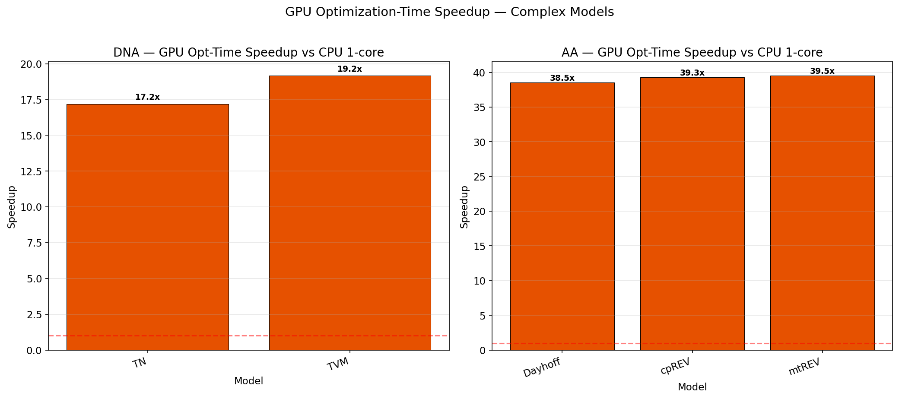

## AA Models - Speedup per Model

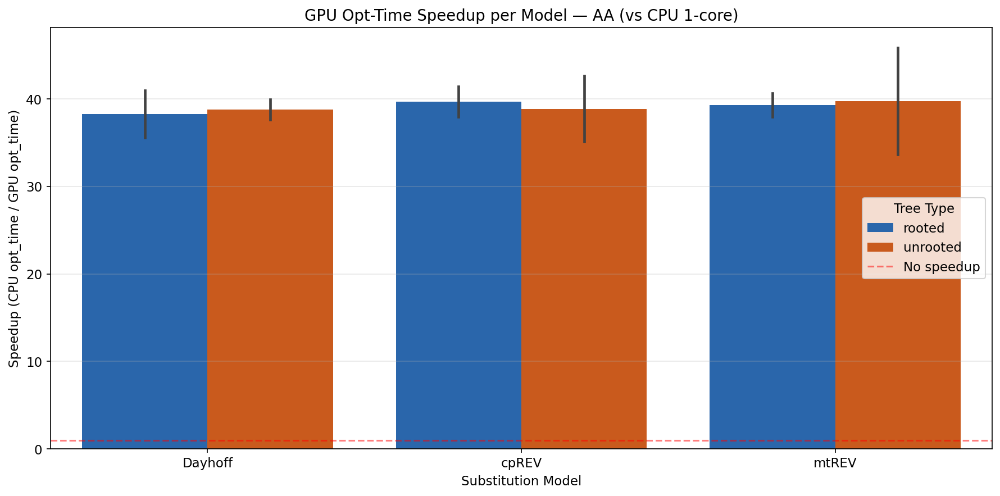

Detailed per-model speedup heatmap (GPU opt_time speedup vs 1-core, per model per tree):

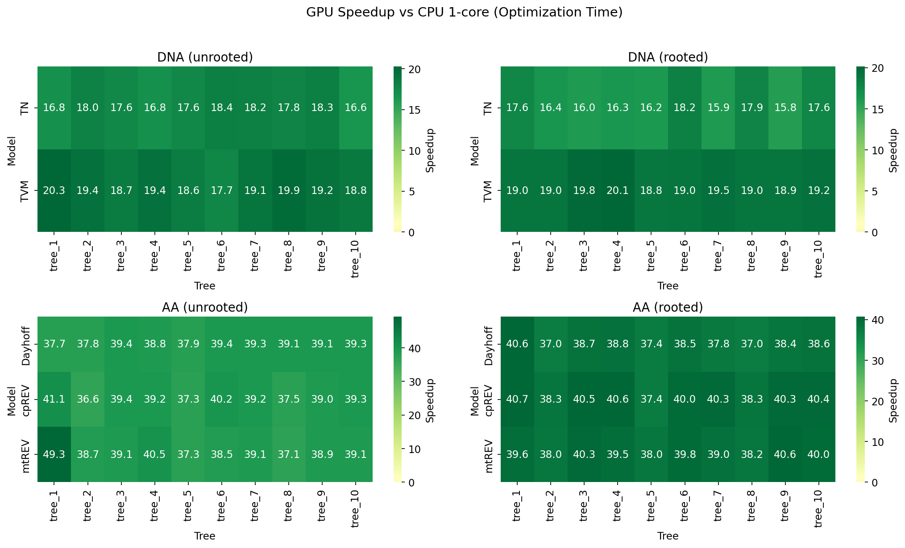

## DNA Models - Speedup per Model

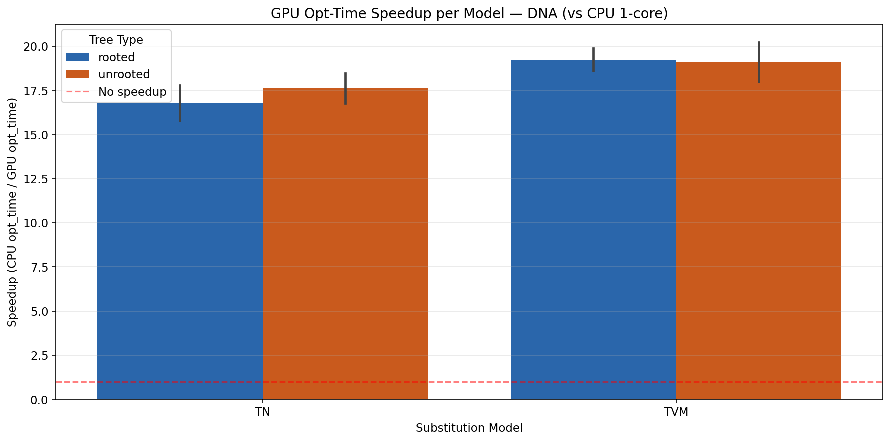

## Combined Overview (All Backends)

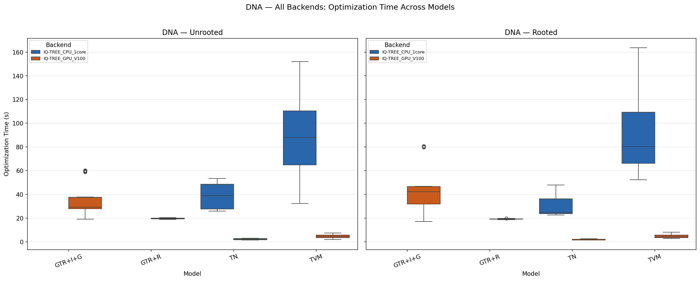

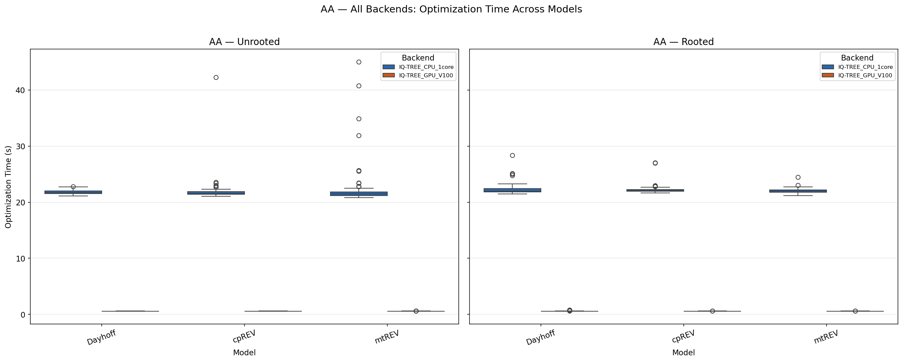

# Results: GPU-Only Models (No CPU Baseline)

For DNA GTR+R and GTR+I+G, the VANILA backend failed with `ERROR: Fixing branch lengths not supported under specified site rate model`. Only GPU timing is available:

- **GTR+R**: mean opt_time ~19.2s (rooted) / ~19.6s (unrooted) - very consistent across trees
- **GTR+I+G**: mean opt_time ~43.6s (rooted) / ~34.7s (unrooted) - higher variance due to model complexity

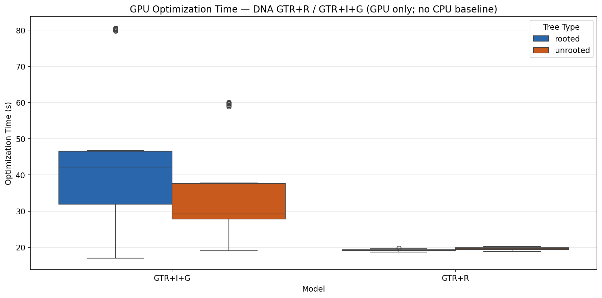

# Results: Runtime Distribution per Tree

Bar+box plots show the optimization time distribution across the 10 tree topologies. Bars represent the mean; boxes show the interquartile range (IQR) across 10 runs.

## DNA - TN model (unrooted)

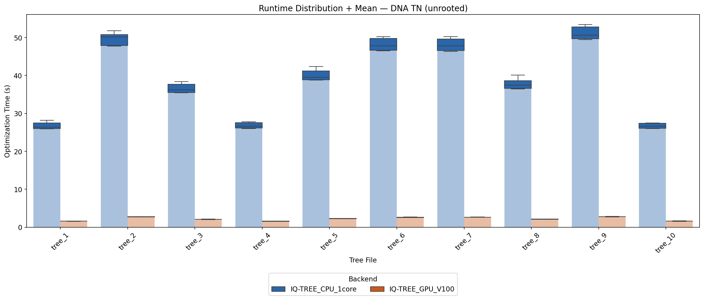

## DNA - TVM model (unrooted)

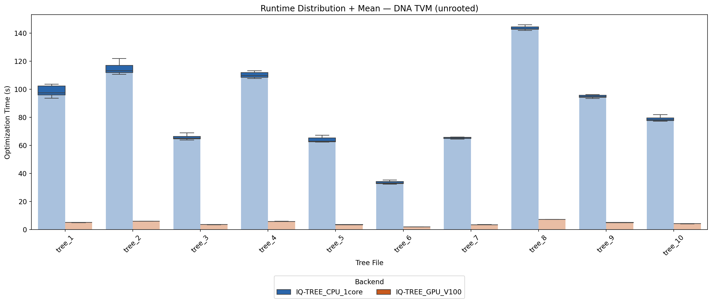

## AA - Dayhoff model (unrooted)

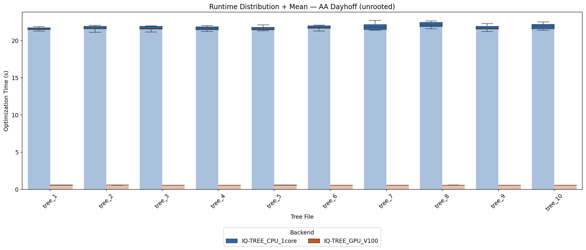

## AA - cpREV model (unrooted)

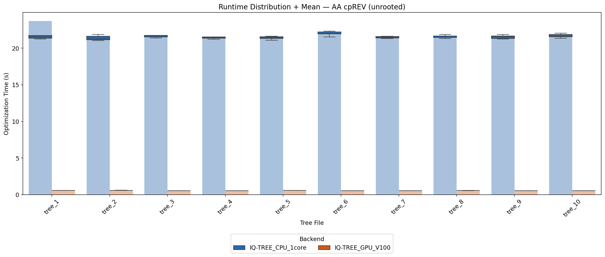

# Likelihood Verification

Both backends produce **perfectly identical** log-likelihood values (max absolute difference = 0.0). All backends are perfectly deterministic (std = 0 across runs for all model-tree combinations). This is a stronger result than the previous benchmark (which showed differences of ~7.45e-9), confirming complete numerical reproducibility.

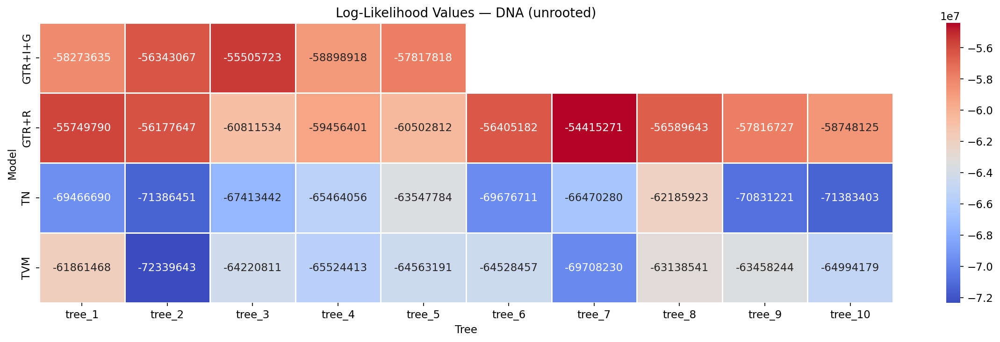

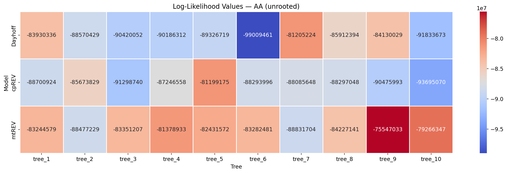

# Conclusions

1. **The GPU V100 massively outperforms single-core CPU on all complex models with available baselines.** AA models (Dayhoff, mtREV, cpREV) achieve ~38.5-39.5x opt_time speedup. DNA complex models (TN, TVM) achieve ~17-19x speedup.

2. **Results are consistent with the previous benchmark on simpler models.** The speedup for AA models (~39x) is in line with the ~39-45x seen for JTT/LG/Poisson/WAG, confirming that GPU acceleration is robust across different AA substitution matrices.

3. **Rate-heterogeneity DNA models (GTR+R, GTR+I+G) ran successfully on the GPU** with opt_times of ~19s and ~35-44s respectively, but VANILA failed due to a `-blfix` flag incompatibility. A CPU baseline run without `-blfix` is needed to compute speedup for these models.

4. **Ultra-complex mixture models (C60, LG+C60, LG4M) could not complete** due to extreme memory requirements (54-310 GB per run). These models require a machine with significantly more RAM than the test system.

5. **Likelihoods are perfectly identical across GPU and CPU backends** (max diff = 0.0), confirming complete numerical correctness. All 10,000 matched run pairs produce bit-identical results.
