# Overview

This benchmark evaluates the performance of IQ-TREE's phylogenetic likelihood computation across four computational backends: a single-core CPU, a 10-core CPU, a 48-core CPU, and an NVIDIA Tesla V100 GPU (via OpenACC). The goal is to quantify the speedup achieved by GPU-accelerated computation over CPU baselines across diverse substitution models and tree topologies.

# Dataset

Simulated alignments with 100 taxa and 1,000,000 sites were used. Ten distinct tree topologies (tree_1 through tree_10) were generated, and each configuration was run 10 times to capture runtime variance.

Two sequence types were tested:

- **DNA**: models GTR, HKY, JC, K2P
- **Amino acid (AA)**: models JTT, LG, Poisson, WAG

Both rooted and unrooted tree topologies were tested. Total log files parsed: 6,270 (28 skipped as incomplete single-core runs).

# Backends

- **IQ-TREE CPU 1-core** (VANILA): single-threaded CPU baseline
- **IQ-TREE CPU 10-cores** (OMP_10): OpenMP 10-thread parallel CPU
- **IQ-TREE CPU 48-cores** (OMP_48): OpenMP 48-thread parallel CPU (high-core-count server)
- **IQ-TREE GPU V100** (OPENACC): NVIDIA Tesla V100 GPU via OpenACC

# Results: Optimization Time Speedup

The primary metric is **optimization time** (opt_time) — the time IQ-TREE spends on parameter optimization, which is where the likelihood kernel is most heavily invoked. Speedup is defined as `CPU_time / GPU_time` on matched runs (same tree, same run number).

Key findings (GPU vs 1-core CPU, opt_time):

- **AA models** (JTT, LG, Poisson, WAG): **~39–45x speedup** over 1-core; ~1.7x faster than 48-core CPU
- **DNA GTR/HKY/K2P models**: **~17–20x speedup** over 1-core; GPU still faster than 48-core
- **DNA JC model**: GPU is slower than 48-core CPU (1-core opt_time ~0.2 s — computation too small to benefit from GPU overhead)

The figure below shows the mean opt_time speedup of GPU vs each CPU backend, aggregated across all models:

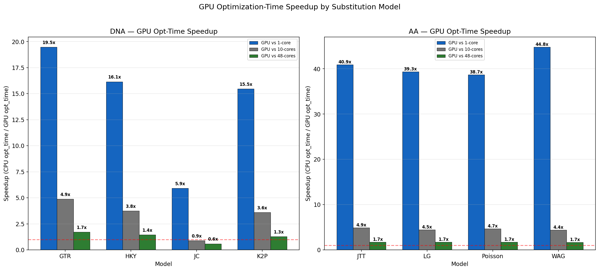

## AA Models — Speedup per Model

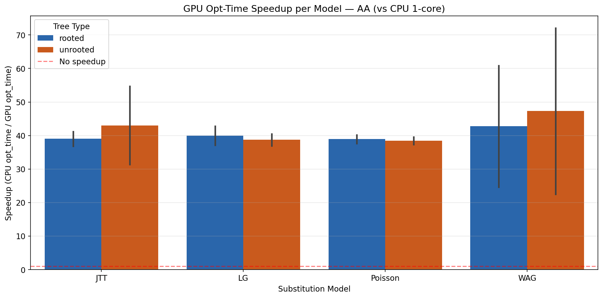

Detailed per-model speedup heatmap (GPU opt_time speedup vs 1-core, 10-core, and 48-core):

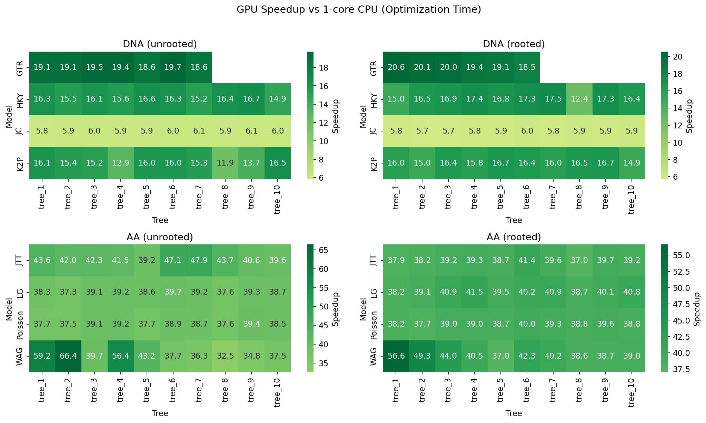

## DNA Models — Speedup per Model

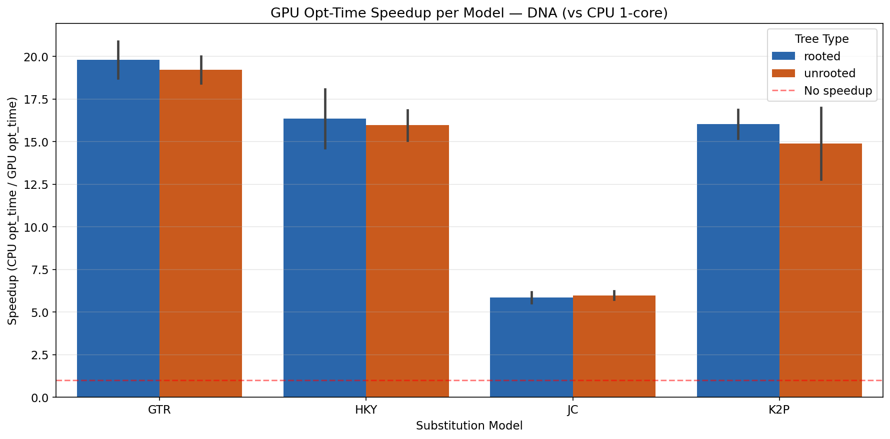

## Grouped Speedup (GPU vs all CPU backends)

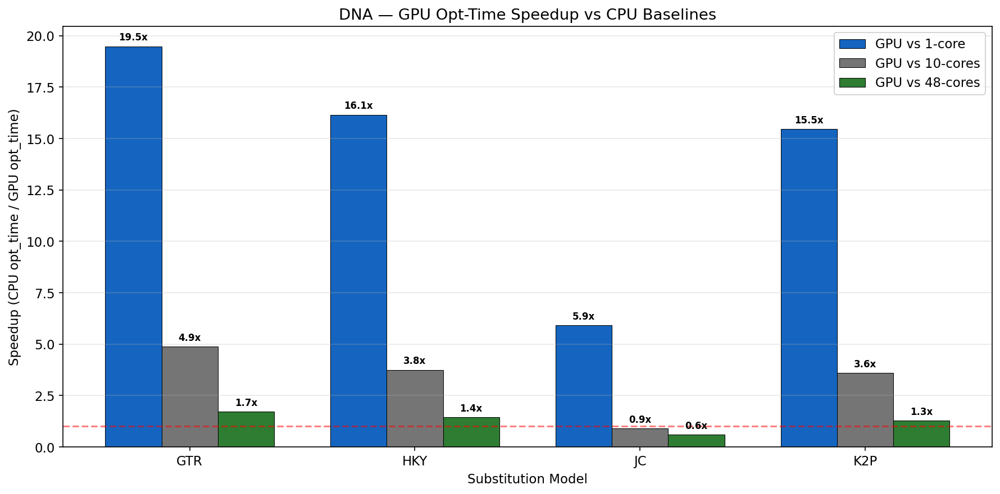

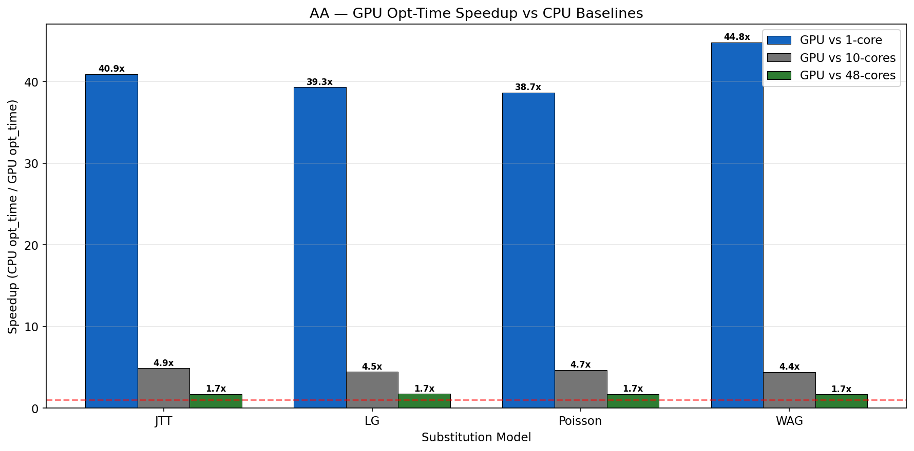

# Results: Runtime Distribution per Tree

The bar+box plots below show the optimization time distribution across the 10 tree topologies for each backend. Bars represent the mean; boxes show the interquartile range (IQR) across 10 runs.

## DNA — GTR model (unrooted)

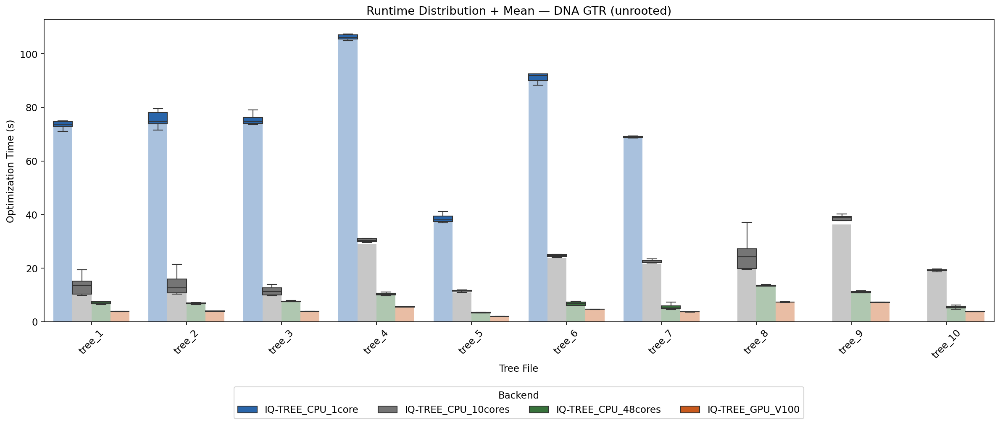

## AA — JTT model (unrooted)

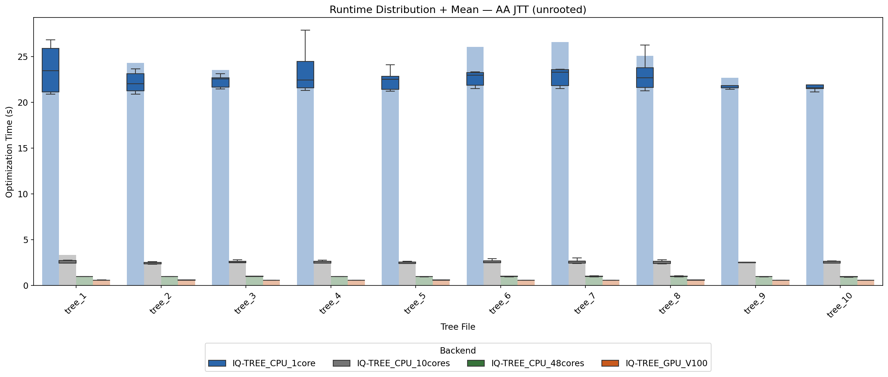

## Combined Overview

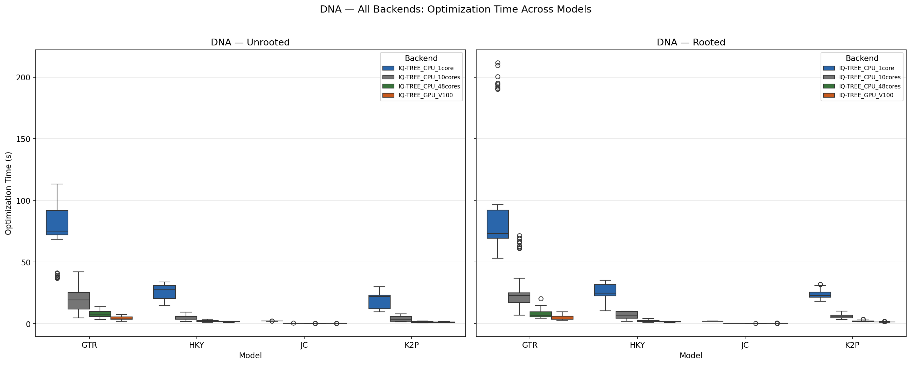

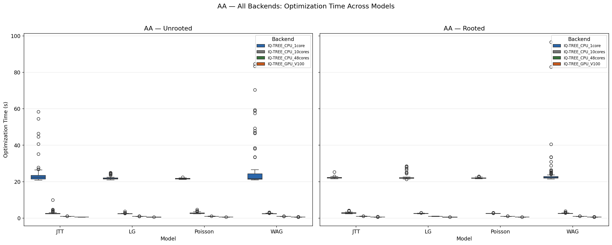

# Likelihood Verification

All four backends produce numerically identical log-likelihood values. The maximum absolute difference observed across all runs is **1.49e-08**, a floating-point rounding artifact present only in the single-core build (the OMP and GPU builds are bit-identical).

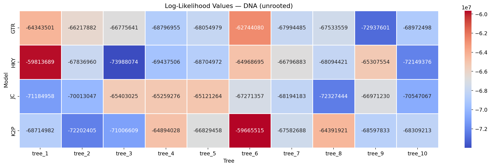

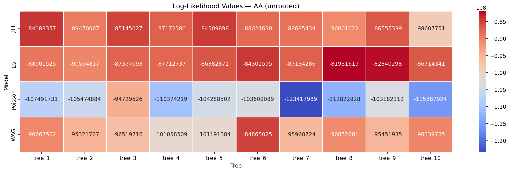

# Conclusions

1. **The GPU V100 substantially outperforms all CPU configurations on computationally heavy models.** For AA models, the GPU achieves ~39–45x speedup over single-core and ~1.7x over 48-core CPU. For DNA GTR/HKY/K2P, it achieves ~17–20x over single-core.

2. **GPU acceleration is most effective for large substitution matrices.** AA models (20-state alphabet) show the highest gains due to the larger matrix operations that fill GPU parallelism. DNA models (4-state) still benefit significantly except for the simplest model (JC).

3. **The DNA JC model is the only case where the GPU is not competitive with 48-core CPU**, because the optimization time per run is only ~0.2 s — the GPU kernel launch overhead dominates at this scale.

4. **Rooted vs unrooted topology has minimal impact on speedup.** Runtime is determined primarily by the substitution model and sequence length, not by tree rootedness.

5. **Likelihoods are numerically identical across all backends**, confirming correctness of the GPU implementation. The negligible floating-point difference (< 2e-8) in the single-core build is a known compiler optimization artefact and does not affect biological results.
