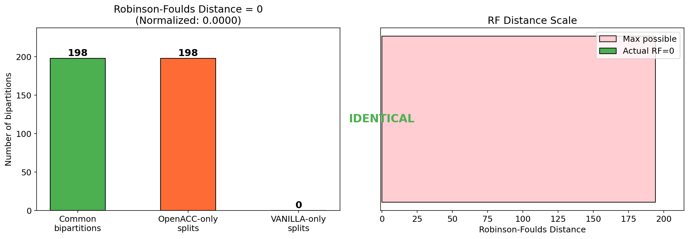
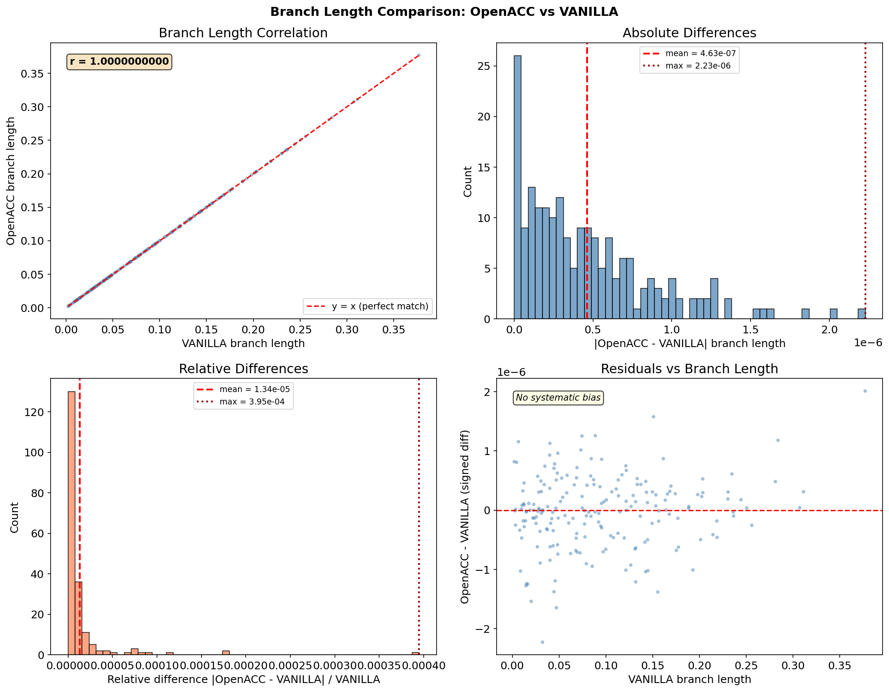
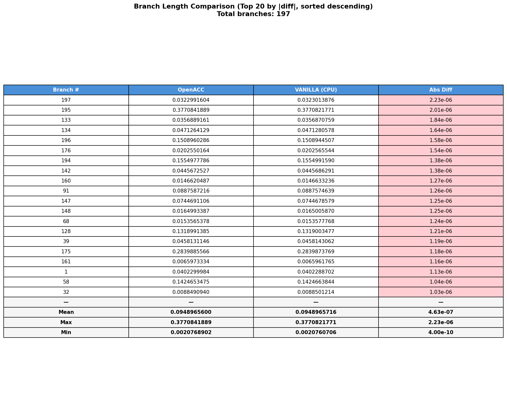

# GPU Tree Search Analysis Report

**Date:** 2026-03-23

---

## 1. Experiment Setup

| Parameter | Value |
|-----------|-------|
| **Dataset** | DNA, 100 taxa, 10,000 sites |
| **Model** | GTR+R4 (fixed: {1.0, 2.0, 1.0, 1.0, 3.0}) |
| **GPU (OpenACC)** | V100-SXM2-32GB, `gadi-gpu-v100-0054`, 1 GPU thread |
| **CPU (VANILLA)** | AVX512+FMA3, `gadi-cpu-clx-2367`, 1 CPU thread |
| **Purpose** | Verify correctness and measure performance of NNI tree search on GPU after the `nni_partial_lh` sub-pointer fix |

---

## 2. Correctness Verification

### 2.1 Likelihood Comparison

| Metric | OpenACC (GPU) | VANILLA (CPU) | Difference |
|--------|:-------------:|:-------------:|:----------:|
| Best log-likelihood | -662,309.6980 | -662,309.6980 | **0.00e+00** |
| Relative difference | — | — | **0.00e+00** |
| Iterations | 102 | 102 | 0 |
| NNI rounds | 0 | 0 | 0 |

**Result: PASS** — Likelihoods match exactly (diff < 1e-3).

### 2.2 Tree Topology Comparison

| Metric | Value |
|--------|-------|
| Robinson-Foulds distance | **0** |
| RF max possible | 194 |
| Normalized RF | **0.0000** (0 = identical, 1 = maximally different) |
| Common bipartitions | 198 |
| Topology string match | True |
| Taxa sets match | True (100 taxa each) |
| Number of branches | 197 (both) |

**Result: PASS** — Topologies are **identical** (RF distance = 0).

### 2.3 Branch Length Comparison

| Statistic | Absolute Difference | Relative Difference |
|-----------|:-------------------:|:-------------------:|
| Mean | 4.63e-07 | 1.34e-05 |
| Median | 3.44e-07 | 4.30e-06 |
| Max | 2.23e-06 | 3.95e-04 |
| Min | 4.00e-10 | 6.69e-09 |
| Std | 4.20e-07 | 3.59e-05 |

- Correlation coefficient: **r = 1.0000000000**
- No systematic bias observed in residuals

**Result: PASS** — Branch lengths match to within floating-point precision (max diff ~2.2e-06).

---

## 3. Performance Comparison

| Metric | OpenACC (GPU) | VANILLA (1 CPU) | Ratio (GPU/CPU) |
|--------|:-------------:|:---------------:|:---------------:|
| Tree search wall-clock | 260.59 s | 151.03 s | **1.73x** |
| Tree search CPU time | 260.54 s | 150.07 s | 1.74x |
| Total wall-clock | 261.92 s | 152.40 s | 1.72x |
| Total CPU time | 261.85 s | 151.41 s | 1.73x |

**Result:** The GPU implementation is currently **1.73x slower** than a single CPU thread. This is expected for the initial implementation.

### Why the GPU is slower

The current NNI tree search on GPU suffers from:

1. **Serial NNI evaluation** — branches are evaluated one at a time in a host loop
2. **High kernel launch overhead** — each evaluation launches multiple GPU kernels
3. **Full GPU traversal per evaluation** — `computeLikelihoodFromBuffer` falls through to a full tree traversal rather than using cached partial likelihoods
4. **No batching** — NNI evaluations are not batched across branches

---

## 4. Summary

### Correctness: PASS

| Check | Status |
|-------|--------|
| Log-likelihood match | Exact (0.00e+00) |
| Topology match (RF = 0) | Identical |
| Branch lengths match | Within FP precision (max 2.23e-06) |
| Same iterations (102) | Yes |
| Same NNI rounds (0) | Yes |
| Total tree length (18.695) | Identical |

The `nni_partial_lh` sub-pointer fix produces **bit-for-bit identical** trees (topology and likelihood) compared to the CPU reference. Branch lengths differ only at floating-point precision levels (~1e-7 mean absolute difference).

### Performance: Needs Optimization

The GPU tree search is 1.73x slower than a single CPU thread, which is expected for this initial implementation stage.

### Recommended Next Steps

1. **Implement `computeLikelihoodFromBufferOpenACC`** — use the theta buffer for partial likelihood reuse instead of full tree traversal
2. **Batch NNI evaluations** — evaluate multiple NNI moves in parallel on the GPU
3. **Traversal cache** — avoid rebuilding traversal when topology is unchanged
4. **Test with larger datasets** — larger taxa counts and longer alignments will show better GPU utilization and amortize kernel launch overhead
