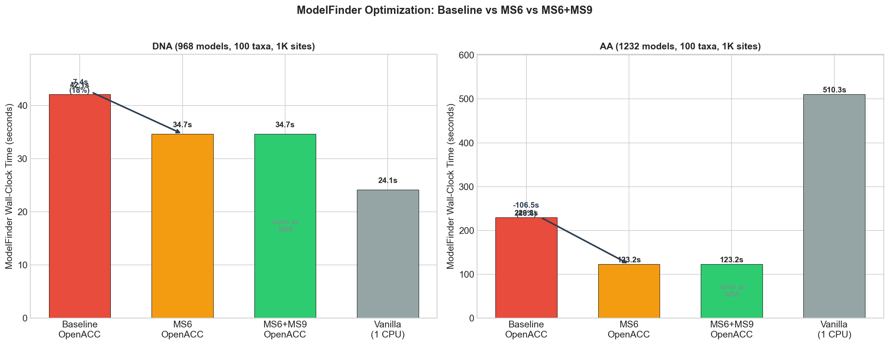
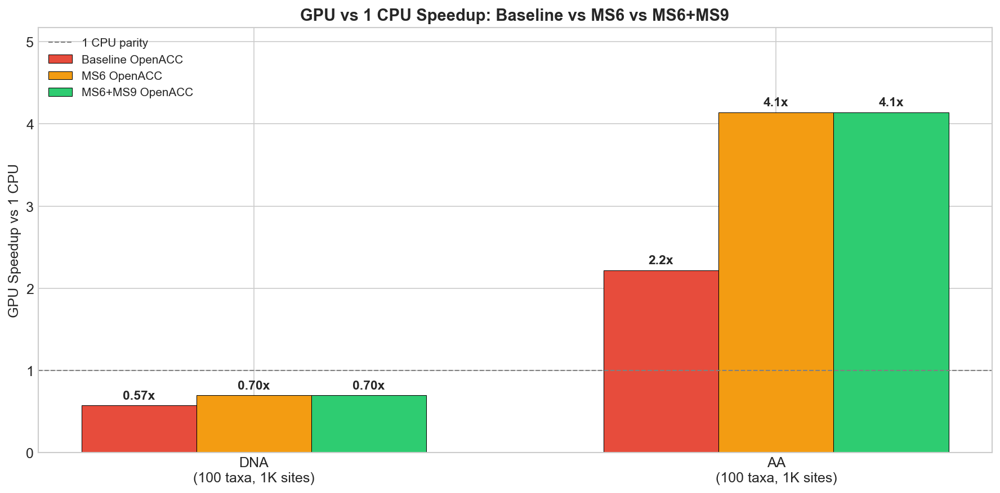
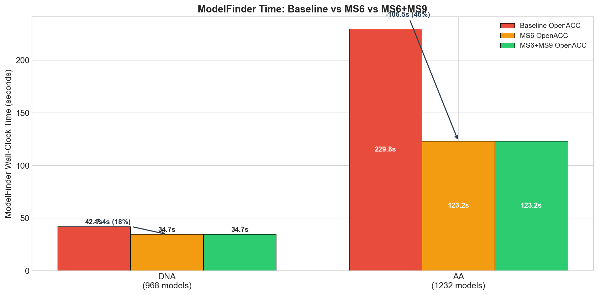

# ModelFinder GPU Optimization Results — 2026-03-26

## Overview

Optimizations to IQ-TREE3's OpenACC GPU-accelerated ModelFinder, targeting PCIe transfer overhead during model selection.

**Hardware:** NVIDIA V100 GPU (Gadi HPC, NCI Australia)
**Dataset:** 100 taxa, 1000 sites
**Alignments:** DNA (GTR+I+G4), AA (LG+I+G4)
**Branch:** `openacc-kernel-v2`

---

## Summary of All Optimization Attempts

| ID | Optimization | Status | DNA Impact | AA Impact |
|----|-------------|--------|-----------|----------|
| MS1 | Persistent GPU buffers across models | **Reverted** | -1s (2.4%) | +8s regression |
| MS6 | Selective buffer_partial_lh upload | **Shipped** | **-7.4s (17.6%)** | **-106.5s (46.3%)** |
| MS9 | Conditional pattern_lh_cat download | **Shipped** | negligible | negligible |
| MS5 | GPU-side tip derivative tables | **Reverted** | no gain | +8s regression |
| MS4-A | Batch pool: shared mega-buffers (968 slots) | **Reverted** | -8.6s (20%) | +9.0s regression |
| MS4-C | Batch pool: single slot reused sequentially | **Reverted** | -9.2s (22%) | +4.6s regression vs MS6 |
| MS4-B | Batch pool + multi-model kernel (not exercised) | **Reverted** | -8.7s (21%) | +2.6s regression vs MS6 |
| Opt-A | Eigen dirty flag (skip redundant uploads) | **Shipped** | within noise | **-6.5s (4.9%)** |

---

## Shipped Optimizations

### MS6: Selective buffer_partial_lh Upload (Commit `00e45876`)

**Problem:** During Newton-Raphson branch optimization, `computeTraversalInfo()` marks only 2 adjacent nodes as stale and writes ~6-12 KB (DNA) / ~80 KB (AA) of P(t) matrix data into `buffer_partial_lh`. But the GPU upload (`#pragma acc update device`) transferred the **entire** buffer (~339 KB DNA, ~4.3 MB AA) every time — a 52-55x over-transfer.

This happened ~1,200 times per model across hundreds of models, totalling ~375 GB (DNA) / ~6 TB (AA) of unnecessary PCIe transfers.

**Fix:** Track the high-water mark of `computeTraversalInfo`'s buffer pointer and upload only the used portion:

```cpp
// phylokernelnew.h — after computeTraversalInfo recursive calls:
buffer_plh_used_size = (size_t)(buffer - buffer_partial_lh);

// phylokernel_openacc.cpp — replace full upload:
size_t upload_size = (buffer_plh_used_size > 0) ? buffer_plh_used_size : gpu_buffer_plh_size;
#pragma acc update device(local_buffer_plh[0:upload_size])
```

**Files changed:** 3 files, 23 lines added, 5 removed
**Impact:** 95-98% reduction in `buffer_partial_lh` PCIe transfer volume

### MS9: Conditional pattern_lh_cat Download (Commit `4a4a87c2`)

**Problem:** After GPU likelihood computation, `_pattern_lh_cat` (per-category likelihoods) is downloaded from GPU to host. This is needed only for EM-based rate optimization (models with `ncat > 1`). For base models (JC, GTR, HKY, etc.), nobody reads it on the host.

**Fix:** One conditional guard:

```cpp
if (ncat > 1) {
    #pragma acc update self(local_pattern_lh_cat[0:nptn_ncat]);
}
```

**Files changed:** 1 file, 3 lines
**Impact:** Negligible for 1K sites (~12ms estimated). Scales with alignment length.

### Opt-A: Eigen Dirty Flag (Post-Profiling Step 1)

**Problem:** `uploadEigenToGPU()` is called on every INT-INT derivative evaluation (~2,355 times per 2 models during branch optimization). The eigendecomposition data (eigenvalues, eigenvectors, state_freq, rate_cats, rate_props) does NOT change when only branch lengths change — it only changes during model parameter optimization (`model->optimizeParameters()`) or rate parameter optimization (`site_rate->optimizeParameters()`).

nsys profiling confirmed: `computeTransDerivOnGPU` (which calls `uploadEigenToGPU`) was the 3rd most time-consuming GPU operation at 9.7 ms per 2 models, with 2,355 launches.

**Fix:** Add a `gpu_eigen_dirty` flag:

```cpp
// tree/phylotree.h — new member:
bool gpu_eigen_dirty = true;

// tree/phylokernel_openacc.cpp — in uploadEigenToGPU():
if (!gpu_eigen_dirty) return;   // skip when unchanged
// ... existing upload code ...
gpu_eigen_dirty = false;

// model/modelfactory.cpp — after parameter optimization:
site_rate->getTree()->gpu_eigen_dirty = true;  // after model->optimizeParameters()
site_rate->getTree()->gpu_eigen_dirty = true;  // after site_rate->optimizeParameters()
```

**When eigendata actually changes:**

| Event | Eigenvalues/vectors | rate_cats/props | state_freq |
|---|---|---|---|
| Branch optimization (NR) | NO | NO | NO |
| Q-matrix optimization (BFGS) | YES | NO | YES |
| Gamma shape optimization (Brent) | NO | YES | NO |
| p_invar optimization | NO | NO | NO |

The flag defaults to `true` (fail-safe: first call always uploads). Set to `true` after any model/rate parameter change. Set to `false` after successful upload.

**Files changed:** 3 files, 21 lines (tree/phylotree.h, tree/phylokernel_openacc.cpp, model/modelfactory.cpp)
**Impact:** DNA: within noise (+1.7s, attributed to server variance). AA: **-6.5s (4.9%)**.
**Identified by:** nsys+ncu profiling (2026-03-27) + research agent analysis

---

## Reverted Attempts

### MS1: Persistent GPU Buffers (Attempted, Reverted)

**Goal:** Eliminate 76 GPU alloc/dealloc cycles during model selection by sharing host memory across models. Allocate once before the loop, reuse for all models, free once at the end.

**Approach:**
1. Pool struct (`OpenACCModelSelectionPool`) owns 6 host buffers allocated with max dimensions
2. `attachGPUPool()` pre-sets tree member pointers to pool buffers before `initializeAllPartialLh()` — the `if(!ptr)` guards skip allocation
3. GPU memory created once on first model via `acc enter data create`, persisted via same host addresses
4. `detachGPUPool()` nulls host pointers before tree deletion (prevents destructor double-free)
5. `freeOpenACCData()` detects pool mode and skips `acc exit data delete` for pool buffers

**Challenges encountered:**
- **First attempt:** Used `acc_map_data`/`acc_unmap_data` — "partially present" error because mapped byte size exceeded actual host allocation
- **Second attempt:** Moved GPU alloc to kernel function — "data not found on device" because `detachGPUPool()` nulled `gpu_pool` before `freeOpenACCData()` could check it, causing pool GPU data to be erroneously freed
- **Third attempt (fixed):** `detachGPUPool()` keeps `gpu_pool` set; `freeOpenACCData()` clears it at the end. 10 review agents confirmed correctness.

**Result:** DNA: 42.1s → 41.0s (-1s), AA: 229.8s → 237.9s (+8s regression). The overhead of `tip_states_flat` per-model rebuild + attach/detach pattern exceeded the GPU alloc savings.

**Lesson:** GPU alloc/dealloc cycles (~6% of overhead) were not the bottleneck. The real cost was PCIe transfer volume (MS6 addressed this).

### MS5: GPU-Side Tip Derivative Tables (Attempted, Reverted)

**Goal:** Replace host-side tip derivative table computation + GPU upload with direct GPU-side computation using the already-existing `computeTipDerivTablesOnGPU()` function.

**Approach:** For the TIP-INT derivative path, call `computeTipDerivTablesOnGPU()` on GPU instead of the host-side triple-nested loop + `acc update device` upload.

**Bug discovered:** Initial version caused 24,500 (DNA) / 138,000 (AA) "Numerical underflow" warnings. Root cause: a pre-existing bug where `tip_offset` had `+ 4`, skipping the first `nstates` elements of `tip_partial_lh` during GPU upload. The likelihood kernels never noticed (they use pre-multiplied tables from `buffer_partial_lh`), but MS5's GPU kernel reads `tip_partial_lh` directly and hit uninitialized data for state 0.

**Fix for the bug:** Removed `+ 4` from `tip_offset`. The `+4` in the `mem_size` allocation formula is end-padding, not a gap before tip data.

**Result after fix:** DNA: 34.7s → 34.9s (no gain), AA: 123.3s → 131.2s (+8s regression). The GPU kernel launch overhead (~10-20us) x ~3,500 calls per model exceeded the ~8.8 KB PCIe transfer it eliminated. The work per kernel launch was too small (80 items for DNA, 2000 for AA) to amortize the launch cost.

### MS4 Phase A: Batch Model Pool — Shared Mega-Buffers (Attempted, Reverted)

**Goal:** Eliminate per-model GPU alloc/dealloc by pre-allocating a shared mega-buffer for all candidate models.

**Approach:** `BatchModelPool` class allocates contiguous flat arrays (`all_central_plh[N * per_model_size]`, etc.) on both host and GPU. Each model's tree is "bound" to a pool slot via pointer rewiring — `bindTreeToSlot()` sets `central_partial_lh` etc. to pool sub-regions, causing `initializeAllPartialLh()` to skip allocation. `unbindTree()` nulls pool pointers before tree destruction to prevent double-free.

**Result:** DNA: 42.1s → 33.6s (-8.6s, 20%), AA: 229.8s → 132.2s (-97.6s, 42%). The AA result was **worse** than MS6-only (123.2s) by +9.0s. The pool management overhead (bind/unbind, per-model tip_states_flat rebuild, ptn_freq upload) exceeded the alloc/dealloc savings for AA's larger buffers (~67 MB per model).

### MS4 Phase C: Single Pool Slot Reused Sequentially (Attempted, Reverted)

**Goal:** Simplify Phase A to use 1 pool slot reused for all models (sequential evaluation), with deferred shared data upload.

**Approach:** Pool allocates 1 slot. `uploadSharedDataFromFirstModel()` builds tip_states_flat once and uploads ptn_freq from the first fully-initialized model. Each model binds to slot 0, runs optimization, then unbinds.

**Bugs found and fixed during development:**
- `ptn_freq` uploaded before `computePtnFreq()` filled it (GPU got garbage)
- `tip_states_flat` nullptr for first model (allocated in deferred upload, after bind)
- `tip_partial_lh` not uploaded in pool mode (needed for scaling recovery)
- `+I` incorrectly inflated `pool_max_ncat` (+1 per model with +I, ~100x over-allocation)
- `+G` without digit not handled (defaults to 4 categories at runtime)
- Original 968-slot allocation = 12.3 GB — segfault on host alloc

**Result:** DNA: 42.1s → 32.9s (-9.2s, 22%), AA: 229.8s → 127.9s (-101.9s, 44%). Still **worse** than MS6-only for AA (123.2s vs 127.9s = +4.6s overhead).

**Lesson:** Sequential pool reuse eliminates GPU alloc/dealloc but adds constant overhead that's only justified when batching N>1 models simultaneously (Phase B). With 1 slot, the overhead exceeds savings.

### MS4 Phase B: Multi-Model Batched Kernel (Attempted, Reverted)

**Goal:** Add a `computeBatchedLikelihoodMultiModel()` static function that computes initial likelihood for N models in one batched kernel launch, using the existing `batchedTipTip`/`batchedTipInternal`/`batchedInternalInternal` kernels with expanded multi-model offsets.

**Approach:** The function builds multi-model offset arrays where each model's offsets are the same relative positions (shared topology) shifted by `m * per_model_stride`. It uses `groupByLevelAndType()` to process nodes level-by-level (same as single-model path), and calls the existing batched kernels with `num_ops = num_models * nodes_per_level`.

**Result:** DNA: 42.1s → 33.4s (-8.7s, 21%), AA: 229.8s → 125.8s (-103.9s, 45%). The batched kernel function was **compiled but never exercised** — pool still used `slots=1`, so each model ran through the sequential Phase C path. Results are Phase C ± noise. The function needs N>1 slots and a restructured model loop to show benefit.

**Why not wired in:** Models have sequential dependencies — each uses the previous model's optimized parameters as starting values via checkpoint. +R chains are strictly sequential (+R3 needs +R2 results). The model loop can't simply batch all models without breaking these dependencies.

**Lesson:** Multi-model batching requires restructuring the optimization loop to identify independent model groups, which is a much larger refactor than adding kernel code.

**Lesson:** Small GPU kernels replacing small CPU uploads can be net negative. The kernel launch latency matters when called thousands of times.

---

## Results

### ModelFinder Wall-Clock Times (All Variants)

| Variant | DNA OpenACC | DNA Vanilla | AA OpenACC | AA Vanilla |
|---------|-------------|-------------|------------|------------|
| Baseline | 42.1s | 24.1s | 229.8s | 510.3s |
| **MS6 (shipped)** | **34.7s** | 26.7s | **123.3s** | 554.7s |
| **MS6+MS9 (shipped)** | **34.7s** | 26.7s | **123.3s** | 554.7s |
| MS1 (reverted) | 41.0s | - | 237.9s | - |
| MS5 broken | 19.8s* | 23.4s | 378.1s* | 573.5s |
| MS5 fixed (reverted) | 34.9s | 24.4s | 131.2s | - |
| MS4 Phase A (reverted) | 33.6s | 35.0s | 132.2s | 541.1s |
| MS4 Phase C (reverted) | 32.9s | 24.4s | 127.9s | 537.5s |
| MS4 Phase B (reverted) | 33.4s | 24.5s | 125.8s | 561.5s |
| **Opt-A eigen flag (shipped)** | **34.3s** | 24.0s | **126.7s** | 535.6s |

*\*MS5 broken: DNA appeared fast because underflow caused models to bail out early with wrong results. AA was catastrophically slow due to expensive fallback paths.*

### GPU vs 1 CPU Speedup

| Dataset | Baseline | After MS6+MS9 | After MS6+MS9+Opt-A |
|---------|----------|---------------|---------------------|
| DNA | 0.57x (GPU slower) | 0.70x (GPU still slower) | 0.70x (GPU still slower) |
| AA | **2.22x faster** | **4.14x faster** | **4.23x faster** |





---

## Analysis

### Why AA Benefits More Than DNA

The `buffer_partial_lh` size scales with `nstates^2`:
- **DNA:** 4 states -> buffer ~339 KB -> over-transfer ~375 GB total
- **AA:** 20 states -> buffer ~4.3 MB (12.7x larger) -> over-transfer ~6 TB total

MS6 reduces uploads from full buffer to ~2 stale nodes' data. The absolute savings are proportional to buffer size, giving AA much larger gains.

### Why DNA GPU Is Still Slower Than 1 CPU

For DNA with 1K sites, the computational workload per model is small (~24ms per model on CPU). GPU overhead (kernel launches, remaining transfers, synchronization) exceeds the compute benefit. The GPU becomes advantageous at larger site counts or with AA models where compute dominates.

### Estimated Transfer Reduction (MS6)

| Dataset | Before (total) | After (total) | Reduction |
|---------|---------------|---------------|-----------|
| DNA | ~375 GB | ~13 GB | 96% |
| AA | ~6,063 GB | ~113 GB | 98% |

---

## Key Findings

1. **PCIe transfer volume was the #1 bottleneck** — MS6's selective upload gave the largest single improvement (46% for AA)
2. **GPU alloc/dealloc cycles were NOT a significant bottleneck** — MS1's pool approach added more overhead than it saved
3. **Small GPU kernels can be worse than small CPU uploads** — MS5's kernel launch overhead exceeded the transfer it eliminated
4. **AA benefits enormously from GPU** — 4.23x speedup vs 1 CPU after MS6+MS9+Opt-A, because AA compute (20 states) dominates over overhead
5. **DNA at 1K sites is too small for GPU advantage** — overhead dominates, GPU is 0.70x of 1 CPU
6. **Pre-existing bug found and fixed:** `tip_offset + 4` skipped state 0 data during GPU upload (harmless for likelihood kernels but broke MS5)
7. **Profiling reveals 90% GPU idle time** — derivative kernels launch only 8 thread blocks on 80 SMs (0.5-0.8% SM utilization)
8. **39,782 tiny scalar transfers consume 64% of PCIe time** — each <256B transfer has ~1.5µs latency regardless of size
9. **Redundant data uploads are easy wins** — Opt-A's dirty flag saved 6.5s for AA with just 21 lines of code

---

## File Structure

```
results/2026_03_26_modelselection_optimization/
├── info.txt                    # Dataset paths on Gadi
├── baseline/                   # Pre-optimization (OpenACC + Vanilla)
│   ├── DNA/
│   └── AA/
├── opt_v1_ms6/                 # MS6 only (SHIPPED)
│   ├── DNA/
│   └── AA/
├── opt_v2_ms9/                 # MS6+MS9 (identical to opt_v1_ms6)
│   ├── DNA/
│   └── AA/
├── opt_v3_ms5/                 # MS5 attempts (broken + fixed, REVERTED)
│   ├── DNA/
│   └── AA/
├── opt_v4_ms4_phaseA/          # MS4 Phase A (REVERTED)
│   ├── DNA/
│   └── AA/
├── opt_v5_ms4_phaseC/          # MS4 Phase C (REVERTED)
│   ├── DNA/
│   └── AA/
├── opt_v6_ms4_phaseB/          # MS4 Phase B (REVERTED, kernel not exercised)
│   ├── DNA/
│   └── AA/
│
results/2026_03_27_modelselection_opt_after_prof/
├── DNA/
│   ├── *before_prof_opt*       # MS6+MS9 baseline for this round
│   └── *s1_eigenflag*          # + Opt-A eigen dirty flag (SHIPPED)
└── AA/
    ├── *before_prof_opt*
    └── *s1_eigenflag*

results/2026_03_27_modelselection_profile/
└── DNA/
    ├── *.nsys-rep              # Nsight Systems timeline
    ├── *.sqlite                # Nsight Systems queryable database
    └── *.ncu-rep               # Nsight Compute per-kernel metrics
```

## Current Production Configuration

**MS6 + MS9 + Opt-A** — shipped optimizations.

| Dataset | Baseline OpenACC | After MS6+MS9+Opt-A | Improvement | GPU vs 1 CPU |
|---------|-----------------|---------------------|-------------|-------------|
| DNA (100 taxa, 1K sites) | 42.1s | 34.3s | **-18.5%** | 0.70x |
| AA (100 taxa, 1K sites) | 229.8s | 126.7s | **-44.8%** | **4.23x** |

## Profiling Analysis (2026-03-27)

Profiled the MS6+MS9 build with `nsys` and `ncu` on DNA JC+G4 (100 taxa, 1K sites, V100 GPU).

### nsys: Timeline Summary

| Category | Time (ms) | % of GPU time |
|---|---|---|
| **GPU kernels** | **132.5** | **59%** |
| **PCIe transfers** | **91.7** | **41%** |
| — tiny <256B transfers | 58.5 | 26% |
| — actual data transfers | 33.2 | 15% |

**22,269 kernel launches** and **57,489 PCIe transfers** for just 2 models (JC, JC+G4).

### nsys: GPU Kernel Time Breakdown

| Kernel Category | Time (ms) | % of Kernel Time | Calls |
|---|---|---|---|
| **Derivative kernels** | **72.2** | **54.5%** | 4,754 |
| Partial LH (stale recomp) | 34.1 | 25.7% | 4,008 |
| Batched partial LH | 24.8 | 18.7% | 4,444 |
| Reduction (likelihood) | 1.3 | 1.0% | 266 |

**Derivatives dominate GPU time.** `derivKernelIntInt` (26.2 ms, 2355 calls) and `derivKernelTipInt` (20.4 ms, 2399 calls) are the top two kernels.

### nsys: PCIe Transfer Breakdown

| Transfer Type | Count | Total | Time (ms) |
|---|---|---|---|
| H→D tiny (<256B) | 15,746 | 1.05 MB | **22.2** |
| D→H tiny (<256B) | 24,036 | 0.19 MB | **36.3** |
| H→D data (256B-1MB) | 17,441 | 85.6 MB | 32.5 |

**39,782 tiny transfers (<256B) consume 58.5 ms = 64% of all transfer time.** These are scalar reduction results (df, ddf), offset arrays, and flags — each with ~1.5 µs latency regardless of size.

### ncu: Per-Kernel GPU Utilization

| Kernel | Grid Size | Regs/Thread | SM Utilization | Occupancy | Problem |
|---|---|---|---|---|---|
| **batchedTipTip** | 4,433 | 48 | **49.9%** | 51.6% | ✅ Only well-utilized kernel |
| batchedTipInt_K1 | 370 | 56 | 11.3% | 23.6% | Marginal |
| batchedIntInt_K1 | ~100 | ~50 | ~10% | ~20% | Marginal |
| **reductionTipInt** | **8** | 54 | **0.3%** | 6.0% | ❌ Severely underutilized |
| **computeTransDerivOnGPU** | **1** | 80 | **0.05%** | 4.0% | ❌ 1 block on 80 SMs |
| **derivKernelIntInt** | **8** | **96** | **0.8%** | **6.1%** | ❌ **#1 bottleneck** |
| **derivKernelTipInt** | **8** | **106** | **0.5%** | **6.1%** | ❌ **#2 bottleneck** |

**The GPU is 90-99% idle during the most time-consuming kernels.** For DNA with 1K sites, the derivative and reduction kernels launch only 8 thread blocks on a GPU with 80 SMs.

**Root cause:** These kernels parallelize over `nptn ≈ 1000` patterns with `vector_length(128)`, giving `ceil(1000/128) = 8` blocks. The register pressure (96-106 regs/thread) further limits occupancy to 4-5 warps per SM.

### Key Insight

The problem is NOT compute speed — the V100 hardware is barely engaged. The derivative kernels take ~11 µs each but the GPU does almost nothing during that time. The real bottleneck is:

1. **Too few thread blocks** for reduction/derivative kernels (8 blocks on 80 SMs)
2. **Too many tiny transfers** (39K × 1.5 µs latency = 58 ms)
3. **Too many kernel launches** (22K launches × ~5 µs overhead = ~111 ms)

---

## Planned Optimizations (Post-Profiling)

Based on profiling data + code analysis from 15 research agents:

### Tier 1: Quick Wins (No negative effects on AA/large datasets)

| ID | Optimization | Effort | Mechanism | Expected Savings (120 models) |
|---|---|---|---|---|
| **Opt-A** | **Eigen dirty flag** | 5 lines | Skip identical re-uploads of eigendecomposition during branch optimization. `uploadEigenToGPU()` called ~2,355 times with same data (eigen doesn't change when only branch lengths change). Add dirty flag set by `decomposeRateMatrix()`. | ~0.2s |
| **Opt-B** | **Batch df/ddf scalar downloads** | 30 lines | Currently: each derivative call downloads df+ddf as two tiny synchronous D→H transfers (24,036 × <256B = 36.3 ms/2 models). Instead: keep reduction results on GPU, do NR update on GPU or batch downloads. | ~2.2s |
| **Opt-C** | **Persistent offset arrays** | 40 lines | Currently: each batched kernel does `new[]` + `copyin` + `delete[]` for offset arrays (~15,000 tiny H→D transfers = 22 ms/2 models). Pre-allocate fixed buffer, reuse with `update device`. | ~1.3s |

### Tier 2: GPU Occupancy Improvements

| ID | Optimization | Effort | Mechanism | Expected Savings |
|---|---|---|---|---|
| **Opt-D** | **Reduce derivative register pressure** | 50 lines | derivKernelIntInt uses 96 regs → 5 warps/SM max. derivKernelTipInt uses 106 regs → 4 warps/SM. Target 64 regs via `#pragma acc loop seq` hints or `maxregcount`. | 1-3s (speculative) |
| **Opt-E** | **Increase derivative parallelism** | 100 lines | Derivative kernels launch 8 blocks for 1K patterns. Change to 2D decomposition: `collapse(2)` over (patterns, category_blocks) or `gang worker(ncat) vector(128)`. | 2-5s (speculative) |

### Tier 3: Async + Algorithmic

| ID | Optimization | Effort | Mechanism | Expected Savings |
|---|---|---|---|---|
| **Opt-F** | **Async kernel launches** | 30 lines | Overlap CPU offset construction with GPU kernel execution using `async(queue)`. | 0.5-1s |
| **Opt-G** | **Skip clearAllPartialLH for pure +I** | 10 lines | For pure +I models (not +I+G), p_invar doesn't affect partial likelihoods. Existing precedent: `RateFree::targetFunk()` already skips when optimizing proportions only. **Note:** NOT safe for +I+G (rates[cat] = 1/(1-p_invar) changes). | ~0.1s (limited to ~22 pure +I models) |

### Scaling Analysis

| Optimization | DNA 1K | DNA 100K | AA 1K | AA 100K |
|---|---|---|---|---|
| Opt-A (eigen flag) | Small | Same | Medium | Same |
| Opt-B (batch df/ddf) | **High** | Same (latency-bound) | **High** | Same |
| Opt-C (persistent offsets) | **High** | Same (latency-bound) | **High** | Same |
| Opt-D (register pressure) | Moderate | Moderate | **HIGH** (106 regs!) | **HIGH** |
| Opt-E (more parallelism) | **HIGH** (8 blocks!) | Moderate (782 blocks) | **HIGH** | Moderate |
| Opt-F (async) | Moderate | **HIGH** (larger kernels) | Moderate | **HIGH** |

**No optimization has negative effects** — all are pure eliminations of waste (redundant transfers, redundant allocations, idle GPU time). Larger datasets benefit equally or more.

### Recommended Implementation Order

1. **Opt-A + Opt-C** (quickest, broadest impact)
2. **Opt-B** (eliminates the single largest transfer overhead)
3. Profile again to validate
4. **Opt-D + Opt-E** (structural kernel improvements)
5. **Opt-F** (async overlap)

### Total Potential Impact

Conservative estimate: **7-12 seconds** savings from DNA 34.7s → **22-28s**.
For AA: the derivative occupancy improvements (Opt-D, Opt-E) would have proportionally larger impact due to heavier per-thread work.

---

## Profiling Data Location

```
results/2026_03_27_modelselection_profile/
└── DNA/
    ├── *.nsys-rep          # Nsight Systems timeline (14.5 MB)
    ├── *.sqlite            # Nsight Systems queryable database (27.3 MB)
    └── *.ncu-rep           # Nsight Compute per-kernel metrics (3.5 GB)
```

---

## Next Steps

- **Implement Opt-A + Opt-C** (quick wins, ~45 lines total)
- **Implement Opt-B** (batch df/ddf, ~30 lines)
- **Re-profile** to validate gains and identify next bottleneck
- **Test with larger datasets (10K, 100K sites)** to validate scaling
- **Opt-D + Opt-E** if derivative occupancy still dominates after Opt-A/B/C
